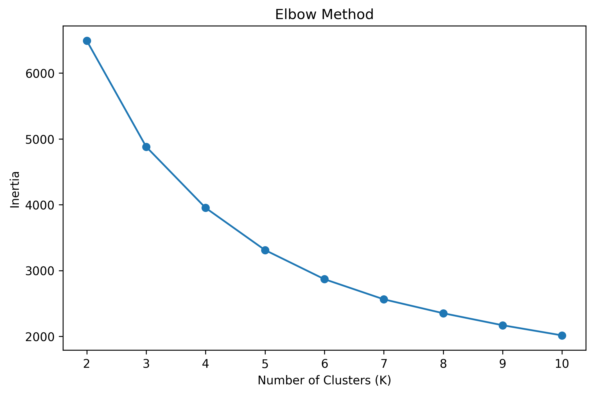
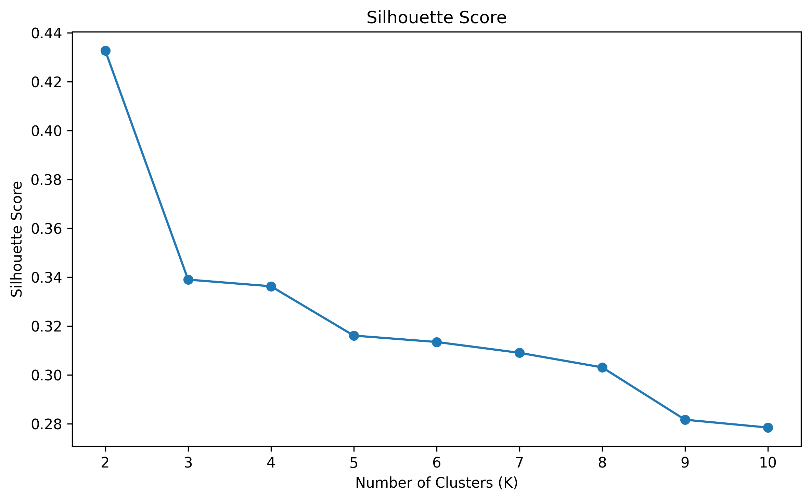
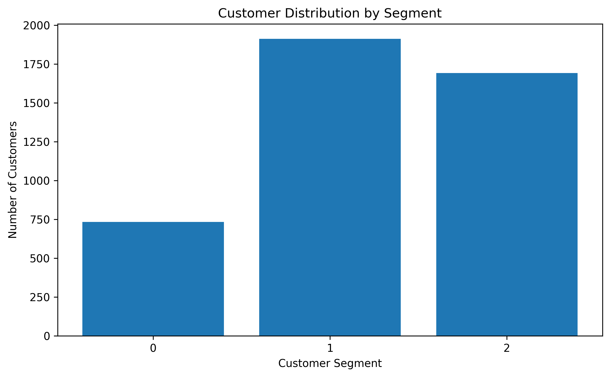

# Online Retail Customer Segmentation

## Project Overview

This project performs customer segmentation on an online retail dataset using
RFM (Recency, Frequency, Monetary) analysis and K-Means clustering.

The objective is to identify groups of customers with similar purchasing
behavior and derive meaningful business insights from those groups.

---

## Business Problem

Retail businesses have customers with different purchasing behaviors.

Some customers purchase frequently and generate high revenue, while others
purchase less frequently or have not purchased recently.

Customer segmentation helps businesses understand these groups and design
more targeted customer engagement strategies.

---

## Dataset

The project uses the `online_retail_customers` table from a SQLite database.

The dataset contains transaction-level information including:

- InvoiceNo
- StockCode
- Description
- Quantity
- InvoiceDate
- UnitPrice
- CustomerID
- Country

The database itself is not included in this repository because of its size.

---

## Technologies Used

- Python 3.11
- Pandas
- NumPy
- Matplotlib
- Seaborn
- Scikit-learn
- SQLite

---

## Methodology

The project follows these steps:

1. Load data from SQLite
2. Explore the dataset
3. Clean the data
4. Remove customers with missing CustomerID
5. Remove cancelled invoices
6. Calculate transaction revenue
7. Create RFM features
8. Analyze distributions and skewness
9. Apply log transformation
10. Standardize the features
11. Evaluate different cluster counts
12. Apply K-Means clustering
13. Analyze customer segments
14. Visualize the clusters using PCA
15. Derive business insights

---

## RFM Analysis

Three customer-level features are created:

### Recency

Number of days since the customer's most recent purchase.

Lower Recency indicates more recent activity.

### Frequency

Number of unique invoices/orders placed by the customer.

Higher Frequency indicates more repeat purchasing.

### Monetary

Total transaction value generated by the customer.

Higher Monetary indicates greater customer value.

---

## Data Transformation

RFM variables have different distributions and scales.

Log transformation using `log1p()` was applied to reduce skewness.

StandardScaler was then used to standardize the transformed features before
K-Means clustering.

---

## Cluster Selection

Both the Elbow Method and Silhouette Score were evaluated for different values
of K.

The highest silhouette score was obtained for K=2.

However, K=3 was retained for additional business interpretation because it
provided more granular and actionable customer profiles.

---

## Customer Segments

The K=3 solution produced the following profiles:

### Highly Active / High Value

- 734 customers
- Average Recency: 15.89 days
- Average Frequency: 13.70
- Average Monetary: 8101.50

### Inactive / Low Value

- 1913 customers
- Average Recency: 164.89 days
- Average Frequency: 1.36
- Average Monetary: 365.51

### Regular / Moderate Value

- 1692 customers
- Average Recency: 43.93 days
- Average Frequency: 3.47
- Average Monetary: 1339.06

---

## Business Insights

The customer segments show substantial differences in purchasing behavior.

The Highly Active / High Value segment contains approximately 16.92% of
customers but contributes approximately 66.73% of the total monetary value.

The Inactive / Low Value segment contains approximately 44.09% of customers
but contributes approximately 7.85% of total monetary value.

The Regular / Moderate Value segment contains approximately 39.00% of
customers and contributes approximately 25.42% of total monetary value.

---

## Visualization

PCA was used to reduce the standardized RFM data to two dimensions for
visualization.

The first two principal components explain approximately 93.8% of the
variance.

PCA was used for visualization only and not for the clustering itself.

---

## Model Evaluation

### Elbow Method



### Silhouette Score



## Customer Segmentation

### PCA Visualization


### Customer Distribution



### Revenue Contribution


## How to Run

### 1. Clone the repository

```bash
git clone <YOUR_GITHUB_REPOSITORY_URL>

### 2. Navigate to the project
cd online-retail-customer-segmentation

### 3. Create a virtual environment.
python -m venv venv

### 4. Activate the environment.
venv\Scripts\activate

### 5. Install the dependencies.
pip install -r requirements.txt

### 6. Add the SQLite database

Place the required database in the expected local location.

### 7. Run the project.
python online_retail_customer_segmentation.py

